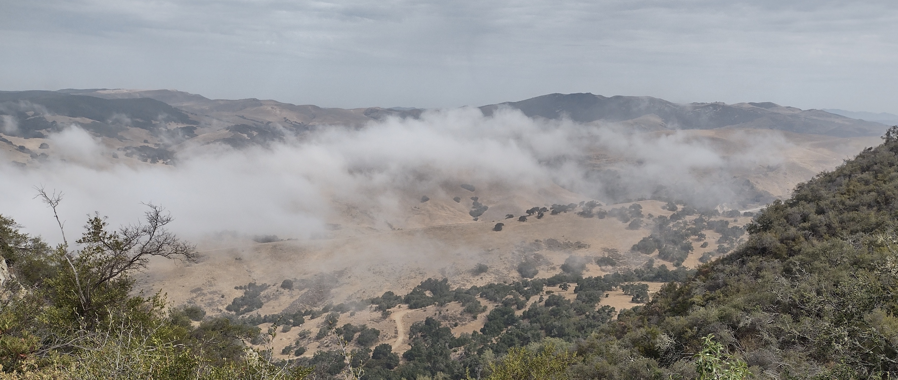

```{r setup, include=FALSE}
knitr::opts_chunk$set(echo = FALSE)

# Learn more about creating websites with Distill at:
# https://rstudio.github.io/distill/website.html

# Learn more about publishing to GitHub Pages at:
# https://rstudio.github.io/distill/publish_website.html#github-pages

```

```{r, out.width = "100%"}

# UPDATE IMAGE HERE 
# or copy/paste this code elsewhere, updating the file path, to add other images to your site!

```

## Welcome!

The Oliver Lab is based at the [University of California, Santa Barbara](https://ucsb.edu) in the [Bren School of Environmental Science & Management](https://bren.ucsb.edu).

## People

Add text 

## Research

Add text

## Join!

Add text

This website is based on a [template](https://github.com/allisonhorst/meds-distill-template) created by Dr. Allison Horst.
