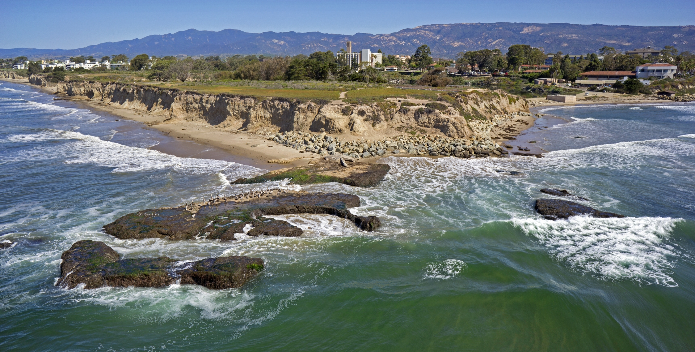
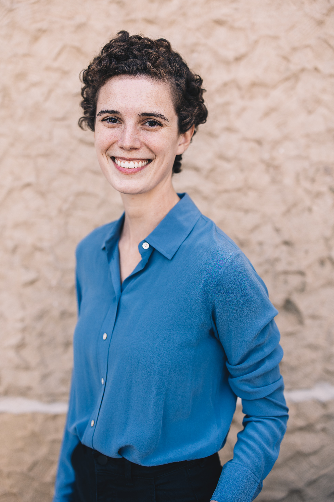

```{r setup, include=FALSE}
knitr::opts_chunk$set(echo = FALSE)

# Learn more about creating websites with Distill at:
# https://rstudio.github.io/distill/website.html

# Learn more about publishing to GitHub Pages at:
# https://rstudio.github.io/distill/publish_website.html#github-pages

```

```{r, out.width = "100%", fig.cap="Campus Point (photo credit: UCSB)"}

# UPDATE IMAGE HERE 
# or copy/paste this code elsewhere, updating the file path, to add other images to your site!

```

## Welcome

Launched in 2022, the Oliver Lab is based at the [University of California, Santa Barbara](https://ucsb.edu) in the [Bren School of Environmental Science & Management](https://bren.ucsb.edu). 

Understanding our planet’s biodiversity has never been more urgent as rapid anthropogenic changes disrupt the world’s ecosystems. Advances in technology and large-scale data mobilization efforts now generate huge amounts of multi-dimensional biodiversity data, in many cases outpacing our ability to rapidly synthesize disparate data types into actionable knowledge. My research program focuses on developing methodologies and leveraging emerging technologies to harness the power of big data to gain new ecological insights.


## People

::: {.floatting}
```{r, out.width = "35%", out.extra='style="float:left; padding:20px"'}

# UPDATE IMAGE HERE 
# or copy/paste this code elsewhere, updating the file path, to add other images to your site!

```
**Ruth Oliver**

Assistant Professor  
Kuni Endowed Junior Faculty Fellow  
(she/her)  
rutholiver\@bren.ucsb.edu  
[CV](https://drive.google.com/file/d/10lPFHHIVch-s5cNXjPn-u62Dr1i8TiLk/view?usp=sharing)
:::

  
## Join!

I'm looking forward to building a supportive and collaborative lab group. There are opportunities to join existing projects and developing new projects together.

### Data scientist
The Oliver Lab is seeking to hire a highly motivated data scientist to work on projects related to wildlife responses to global change. Position details can be found here: (https://recruit.ap.ucsb.edu/JPF02771). UCSB is an AA/EOE, including disability/vets  


### Graduate students

PhD students can join the group through the [Bren School PhD program](https://bren.ucsb.edu/phd-environmental-science-and-management).
I will be recruiting students to start fall 2024.

Instead of emailing me, please fill out the interest survey below, so I can better organize my responses. 
Please check out the [Resources](resources.html) page for tips on how to craft your message.  

***Note:*** You are more than welcome to reach out to other potential advisors at UCSB.


### Postdoctoral researchers

I will be welcoming postdocs on an ongoing basis, depending on funding availability. If our research interests align, please fill out the interest survey below. I am happy to develop fellowship proposal(s) together. Please check out the [Resources](resources.html) page for a list of potential fellowships. I am currently recruiting through the [Bren Global Change Postdoctoral Fellowship](https://www.globalchangepostdoctoralfellowship.com/).

### Interest survey

Fill out [here](https://forms.gle/w8uBoMAkmjrUXRgs7)!

This website is based on a [template](https://github.com/allisonhorst/meds-distill-template) created by Dr. Allison Horst.
