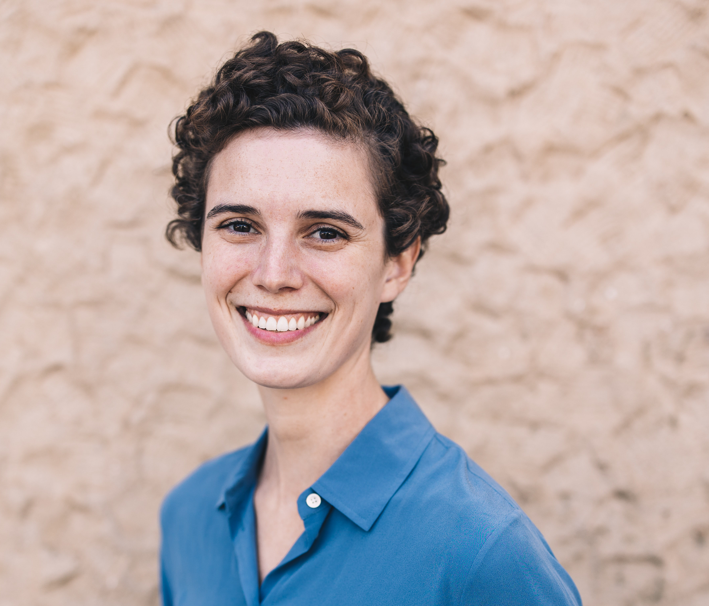

```{r setup, include=FALSE}
knitr::opts_chunk$set(echo = FALSE)

# Learn more about creating websites with Distill at:
# https://rstudio.github.io/distill/website.html

# Learn more about publishing to GitHub Pages at:
# https://rstudio.github.io/distill/publish_website.html#github-pages

```

```{r, out.width = "100%"}

# UPDATE IMAGE HERE 
# or copy/paste this code elsewhere, updating the file path, to add other images to your site!

```

## Welcome!

The Oliver Lab is based at the [University of California, Santa Barbara](https://ucsb.edu) in the [Bren School of Environmental Science & Management](https://bren.ucsb.edu).

Understanding our planet’s biodiversity has never been more urgent as rapid anthropogenic changes disrupt the world’s ecosystems. Advances in technology and large-scale data mobilization efforts now generate huge amounts of multi-dimensional biodiversity data, in many cases outpacing our ability to rapidly synthesize disparate data types into actionable knowledge. My research program focuses on developing methodologies and leveraging emerging technologies to harness the power of big data to gain new ecological insights and create global biodiversity metrics that can inform policy choices.

Our group focuses on:

-   leveraging automated biodiversity sensors (e.g. audio recorders, camera traps)
-   using tracking technology to understand how animals navigate increasingly modified environments
-   developing global metrics to track progress on filling biodiversity data gaps
-   creating a more equitable scientific community, by listening, learning, struggling, and trying again

If any of this interests you, see details on joining below!

## People

::: {.floatting}
```{r, out.width = "30%", out.extra='style="float:left; padding:10px"'}

# UPDATE IMAGE HERE 
# or copy/paste this code elsewhere, updating the file path, to add other images to your site!

```
**Ruth Oliver** (she/her/hers)

**Assistant Professor** - UCSB  
**Associate Research Scientist** - Yale University  
**PhD** - Earth & Environmental Science, Columbia University  
**BA** - Physics, Claremeont McKenna College  

**email**: rutholiver\@bren.ucsb.edu
:::

  
## Join!

Add text


This website is based on a [template](https://github.com/allisonhorst/meds-distill-template) created by Dr. Allison Horst.
